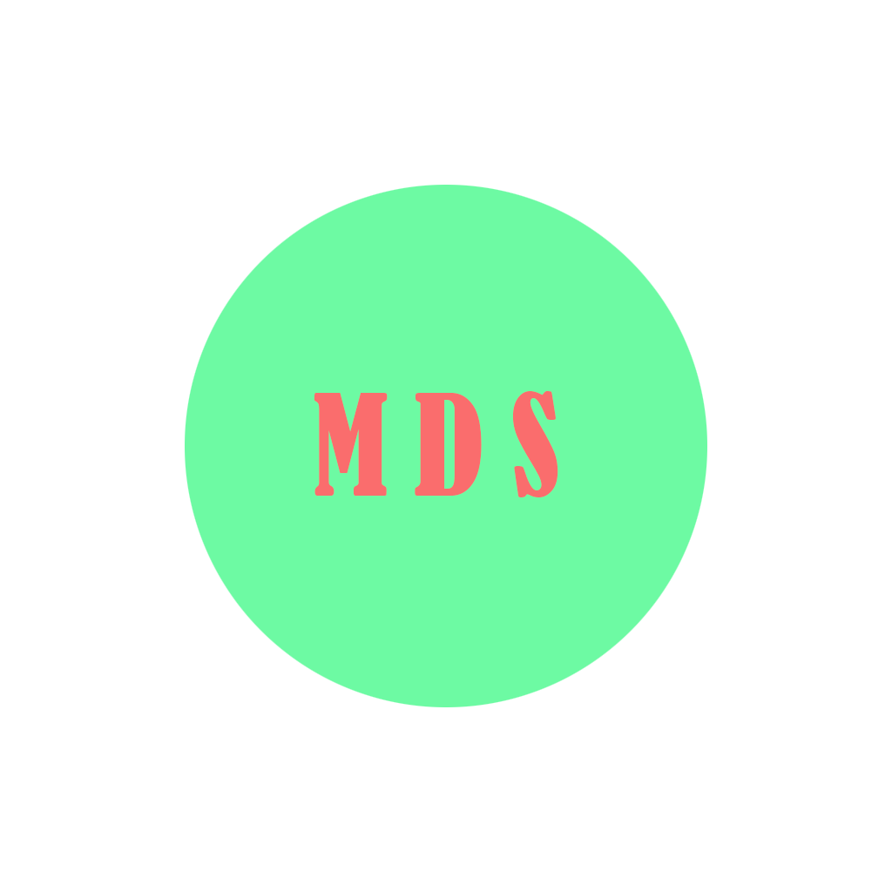

# MTR-Station-Decoration-Addon

<h2>A Station Decoration Addon for the Minecraft Transit Railway Mod</h2>

## Setup

<h3>
   1. Clone this repository
</h3>
<h3>
   2. Switch a Minecraft version
</h3>
<h3>
   3. Sync the Gradle project
</h3>

## Link

   
   
   
   

## License

[MIT License](https://raw.githubusercontent.com/AIDA64S/MTR-Station-Decoration-Addon/master/LICENSE)

## Thanks

   
   

   
   

